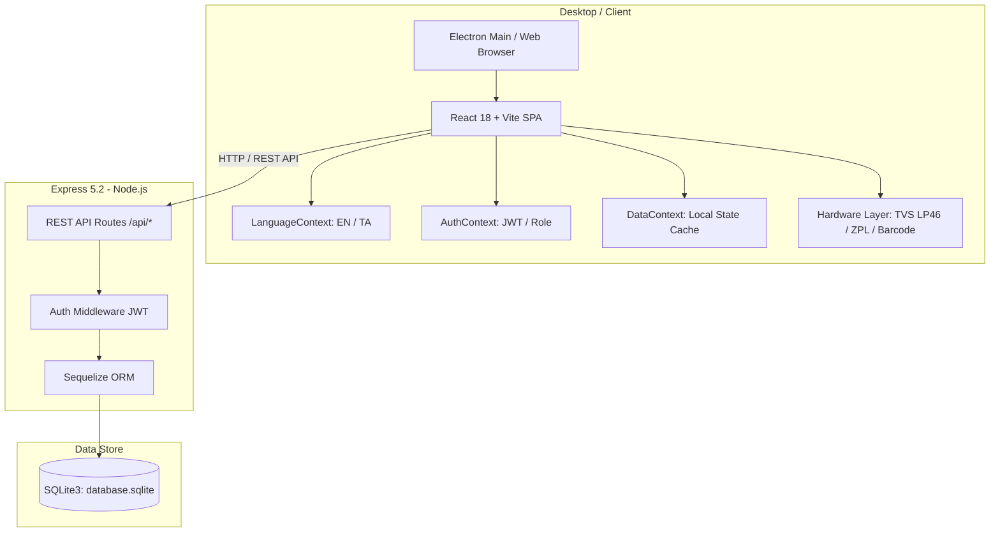

# Durgas POS Billing System — Complete Project Architecture & Context

> **Note for Claude:** This document contains the complete structural and architectural blueprint of the **Durgas POS Billing System** repository (`Durgas_billing_new`). Use this context to analyze the application, suggest optimizations, generate features, review security, or design enhancements.

---

## 1. Executive Summary

- **Project Name:** Durgas POS Billing Application (துர்காஸ் பில்லிங் சிஸ்டம்)
- **Domain:** Retail Point-of-Sale (POS) & ERP specifically tailored for **Textile, Saree, and Apparel Showrooms**, while also supporting general retail (Jewelry, Mens, Kids, Womens, etc.).
- **Platforms:**
  - **Desktop Application:** Standalone Electron app packaged for Windows/Linux with an embedded Node.js backend and portable SQLite database.
  - **Web Application:** Standard Vite + React SPA deployable to local networks or cloud servers.
- **Key Highlights:**
  - Fast barcode scanning & thermal receipt printing (TVS LP-46, Zebra/ZPL, BPLZ compiler).
  - Bilingual UI with seamless English and Tamil (தமிழ்) toggle.
  - Specialized textile features: Saree Master (Zari, border, material, blouse piece), Alteration/tailoring tracking, and Order bookings.
  - Complete retail operations: Billing, Hold Bills, Customer Due Management, Staff Commissions, Inventory, Expenses, GST Reports, WhatsApp customer messaging, and SQLite backup/restore.

---

## 2. Technology Stack

### Frontend
- **Framework:** React 18.3.1 + TypeScript 5.8
- **Build Tool:** Vite 8.0 with `@vitejs/plugin-react-swc`
- **Routing:** React Router DOM 6.30 (HashRouter for Electron compatibility)
- **Styling:** Tailwind CSS 3.4, Vanilla CSS, `tailwindcss-animate`, `@tailwindcss/typography`
- **UI Component Primitives:** Radix UI primitives (`@radix-ui/react-*`), Lucide Icons (`lucide-react`)
- **State & Data Fetching:** TanStack React Query 5.9, React Context (`AuthContext`, `DataContext`, `LanguageContext`), React Hook Form + Zod
- **Data Visualization & Export:** Recharts 2.15, jsPDF + jspdf-autotable, SheetJS (xlsx), `react-to-print`, `qrcode.react`, `react-barcode`

### Desktop (Electron)
- **Runtime:** Electron 44.3.0
- **Process Model:** Main Process (`electron/main.cjs`), Preload Script (`electron/preload.cjs`), and Renderer (React Vite bundle).
- **Packaging:** Custom native bundler (`scripts/package-electron.cjs`) creating portable self-contained Windows distributions with bundled Node runtime and native SQLite bindings.

### Backend
- **Server:** Node.js + Express 5.2.1
- **Database ORM:** Sequelize 6.37
- **Database Engine:** SQLite 3 (`sqlite3` 5.1.7) configured in single-file mode (`database.sqlite`) with `PRAGMA journal_mode = DELETE` and `synchronous = NORMAL` for reliable Windows filesystem operations.
- **Authentication:** JWT (`jsonwebtoken`) + Password Hashing (`bcryptjs`).
- **Dynamic Port Allocation:** Auto-detects port conflicts (starts on 5000, rolls over up to 10 ports, or binds to OS port 0) and writes runtime credentials to `active_port.json`.

---

## 3. High-Level Architecture & Workflow



---

## 4. Directory & File Structure

```
Durgas_billing_new/
├── .vscode/                     # VS Code workspace settings
├── backend/                     # Node.js Express + SQLite backend
│   ├── database/                # SQLite storage location
│   ├── middleware/              # Auth & validation middlewares
│   ├── models/                  # 13 Sequelize database models
│   │   ├── Adjustment.js        # Stock inventory adjustments
│   │   ├── Alteration.js        # Tailoring & alteration job tracking
│   │   ├── Bill.js              # Invoices & sales transactions
│   │   ├── Customer.js          # Customer profiles, balances & dues
│   │   ├── Expense.js           # Daily shop expense tracker
│   │   ├── Order.js             # Customer advance booking orders
│   │   ├── Product.js           # Inventory items / Sarees master
│   │   ├── Purchase.js          # Supplier purchase inward entries
│   │   ├── Return.js            # Customer & supplier returns
│   │   ├── Settings.js          # Store metadata, GST, receipt branding
│   │   ├── Staff.js             # Staff profiles & commission tracking
│   │   ├── Supplier.js          # Supplier ledger & pending dues
│   │   └── User.js              # Authentication accounts (Admin/Staff)
│   ├── routes/                  # Express REST API routes
│   │   ├── adjustmentRoutes.js  # /api/adjustments
│   │   ├── alterationRoutes.js  # /api/alterations
│   │   ├── authRoutes.js        # /api/auth (login, register, seed)
│   │   ├── billRoutes.js        # /api/bills
│   │   ├── customerRoutes.js    # /api/customers
│   │   ├── expenseRoutes.js     # /api/expenses
│   │   ├── migrationRoutes.js   # /api/migration (import/export)
│   │   ├── orderRoutes.js       # /api/orders
│   │   ├── productRoutes.js     # /api/products & /api/sarees
│   │   ├── purchaseRoutes.js    # /api/purchases
│   │   ├── reportRoutes.js      # /api/reports (sales, GST, charts)
│   │   ├── returnRoutes.js      # /api/returns
│   │   ├── settingsRoutes.js    # /api/settings
│   │   ├── staffRoutes.js       # /api/staff
│   │   ├── supplierRoutes.js    # /api/suppliers
│   │   └── uploadRoutes.js      # /api/upload (images/logos)
│   ├── tests/                   # Backend smoke and unit tests
│   ├── database.js              # Sequelize SQLite connection & PRAGMAs
│   ├── package.json             # Backend dependencies
│   └── server.js                # Server entry, port failover, route mounting
├── electron/                    # Electron Desktop Layer
│   ├── main.cjs                 # Main process, lifecycle & windows
│   ├── preload.cjs              # Context isolation & IPC bridge
│   └── package.json             # Electron configuration
├── public/                      # Static assets & icons
│   └── durgas-logo.jpeg         # Default logo
├── scripts/                     # Packaging & execution scripts
│   ├── package-electron.cjs     # Standalone portable EXE packager
│   └── run-electron.cjs         # Electron dev runner
├── tools/                       # Developer utilities
│   └── barcode-tester/          # Dedicated barcode layout & printer studio
├── src/                         # Frontend Application (React 18 + TypeScript)
│   ├── components/              # Modular UI components
│   │   ├── barcode/             # Barcode designer & print preview
│   │   ├── billing/             # POS billing items, cart, receipts & preview
│   │   │   ├── BillReceipt.tsx        # Thermal receipt layout & printer styles
│   │   │   ├── BillingCustomerForm.tsx# Quick customer lookup & phone entry
│   │   │   ├── BillingHeader.tsx      # Bill metadata, invoice number, date
│   │   │   ├── BillingItemInput.tsx   # Barcode scanner input & quick search
│   │   │   ├── BillingItemsTable.tsx  # Dynamic line items grid
│   │   │   ├── BillingPreviewCard.tsx # Real-time invoice modal/preview
│   │   │   ├── BillingSummaryCard.tsx # Totals, discount, GST, roundoff
│   │   │   └── useBillingState.ts     # Core POS billing calculations hook
│   │   ├── customers/           # Customer management modals & tables
│   │   ├── dashboard/           # KPIs, sales trends, quick stat cards
│   │   ├── expenses/            # Daily expenses table & category filters
│   │   ├── gst/                 # GSTR-1, GSTR-3B tax report generators
│   │   ├── history/             # Invoices history table & re-print modals
│   │   ├── inventory/           # Stock grid, low stock alerts & barcode tags
│   │   ├── layout/              # AppSidebar, TopHeader, MainLayout
│   │   ├── purchase/            # Inward purchase entries & supplier forms
│   │   ├── reports/             # Sales report filters & charts
│   │   ├── returns/             # Bill return and credit note dialogues
│   │   ├── setup/               # Initial store configuration wizard
│   │   ├── suppliers/           # Supplier management & ledger
│   │   └── ui/                  # 30+ reusable Radix UI / Tailwind primitives
│   ├── contexts/                # Global React Contexts
│   │   ├── AuthContext.tsx      # Current user, login, logout, roles
│   │   ├── DataContext.tsx      # Central store cache (products, bills, customers)
│   │   └── LanguageContext.tsx  # English & Tamil translations (i18n)
│   ├── hooks/                   # Custom React hooks (toast, mobile detection)
│   ├── lib/                     # Utilities & hardware drivers
│   │   ├── printer/             # TVS LP-46, BPLZ & QZ Tray hardware printers
│   │   │   ├── BPLZCompiler.ts   # Converts label layouts to TVS/Zebra raw bytes
│   │   │   ├── QZTransport.ts    # QZ Tray WebSocket printing transport
│   │   │   ├── TVSLP46Printer.ts # Dedicated TVS LP-46 barcode printer driver
│   │   │   └── index.ts          # Printer factory and fallback handlers
│   │   ├── api.ts               # Axios/Fetch wrapper for backend endpoints
│   │   ├── barcodeLayout.ts     # Label layout models (Single, 2-up, 3-up)
│   │   ├── barcodeValidator.ts  # Code128 / EAN13 barcode validation
│   │   ├── billingCalculations.ts# GST, discount, and roundoff logic
│   │   ├── soundEffects.ts      # POS audio beeps (scan success, error, bill saved)
│   │   └── trie.ts              # Fast prefix search for products & barcodes
│   ├── pages/                   # 29 Application Pages / Views
│   │   ├── AdminCustomization.tsx # Brand colors, theme injector, shop details
│   │   ├── AlterationService.tsx  # Blouse/Fall/Pico tailoring service manager
│   │   ├── BackupRestore.tsx      # Database backup & restore utility
│   │   ├── BillHistory.tsx        # Previous bills, reprints, status updates
│   │   ├── Billing.tsx            # High-speed POS billing terminal
│   │   ├── CustomerManagement.tsx # Customer directory, credit balance
│   │   ├── Dashboard.tsx          # Store performance, sales stats, widgets
│   │   ├── DataMigration.tsx      # Bulk CSV/Excel import/export for stock & bills
│   │   ├── DueManagement.tsx      # Pending customer dues & payment collection
│   │   ├── Expenses.tsx           # Shop expenses & petty cash logging
│   │   ├── GstReports.tsx         # Monthly/Quarterly GST calculation & export
│   │   ├── HoldBill.tsx           # Paused / parked cart management
│   │   ├── Inventory.tsx          # Stock list, barcode tag printing, edits
│   │   ├── Login.tsx              # Authentication page
│   │   ├── OrderBooking.tsx       # Custom customer orders & advance payments
│   │   ├── Profile.tsx            # Logged-in user settings & password reset
│   │   ├── PurchaseEntry.tsx      # Purchase from suppliers & stock inward
│   │   ├── PurchaseReturn.tsx     # Return defective stock to suppliers
│   │   ├── Reports.tsx            # Revenue analytics, sales charts, staff metrics
│   │   ├── ReturnsExchange.tsx    # Customer exchange & refund processing
│   │   ├── SareeMaster.tsx        # Specialized Saree & Textile product form
│   │   ├── Settings.tsx           # Store profile, tax rates, receipt templates
│   │   ├── SetupWizard.tsx        # First-time user onboarding wizard
│   │   ├── StaffManagement.tsx    # Sales staff, attendance, commissions
│   │   ├── StockAdjustment.tsx    # Stock audit, damage loss, manual adjustment
│   │   ├── SupplierManagement.tsx # Vendor ledger & payment tracking
│   │   └── WhatsappMessenger.tsx  # Direct WhatsApp receipt & reminder dispatch
│   ├── types/                   # TypeScript interfaces & types
│   │   ├── bill.ts              # Bill, BillItem, PaymentMethod
│   │   └── index.ts             # Saree, Customer, Supplier, Staff, Settings
│   ├── App.tsx                  # Root router, ThemeInjector, ProtectedRoute
│   ├── index.css                # Global theme tokens, typography & animations
│   └── main.tsx                 # React DOM mount point
├── package.json                 # Project configuration & NPM scripts
├── tailwind.config.ts           # Design tokens, silk patterns, warm palette
└── vite.config.ts               # Vite configuration with proxy to backend
```

---

## 5. Core Data Models (Sequelize)

| Model | Table Name | Key Fields | Purpose |
| :--- | :--- | :--- | :--- |
| **User** | `Users` | `id`, `username`, `password` (hashed), `role` (`admin`/`staff`), `name` | User authentication & permission control |
| **Product** | `Products` | `barcode`, `name`, `nameTamil`, `category`, `department`, `material`, `zariType`, `color`, `purchasePrice`, `sellingPrice`, `mrp`, `gstPercent`, `stockQty`, `stockType` | Complete textile/apparel inventory catalog |
| **Bill** | `Bills` | `billNo`, `customerName`, `customerMobile`, `items` (JSON), `subtotal`, `discountAmount`, `taxAmount`, `roundOff`, `grandTotal`, `paymentMethod`, `status` (`Paid`/`Hold`/`Due`), `dueAmount`, `date` | Point-of-Sale sales receipts |
| **Customer** | `Customers` | `name`, `mobile`, `place`, `pendingDue`, `totalPurchases`, `billsCount`, `visitCount` | Customer ledger, CRM, and due tracking |
| **Staff** | `Staffs` | `name`, `role`, `commissionType` (`Percentage`/`Fixed`), `commissionValue`, `salesThisMonth`, `active` | Sales executive commission & tracking |
| **Supplier** | `Suppliers` | `name`, `contactPerson`, `mobile`, `gstin`, `location`, `pendingDue` | Inward vendor profiles & pending payments |
| **Purchase** | `Purchases` | `billNo`, `supplierId`, `supplierName`, `items` (JSON), `totalAmount`, `paidAmount`, `dueAmount`, `paymentStatus` | Stock inward & vendor invoices |
| **Return** | `Returns` | `billNo`, `customerName`, `items` (JSON), `refundAmount`, `reason`, `type` (`Customer`/`Supplier`) | Returns, exchanges, and credit notes |
| **Adjustment**| `Adjustments` | `barcode`, `name`, `currentStock`, `adjustQty`, `reason`, `status` | Stock audit discrepancies, damage write-offs |
| **Order** | `Orders` | `customerName`, `customerMobile`, `description`, `deliveryDate`, `totalEstimated`, `advancePaid`, `status` | Custom saree/garment pre-orders |
| **Alteration**| `Alterations` | `customer`, `mobile`, `items`, `services` (Fall/Pico/Blouse), `status`, `deliveryDate`, `amount` | Tailoring and alteration workflow |
| **Expense** | `Expenses` | `category`, `amount`, `paymentMethod`, `notes`, `date` | Petty cash & operational expenses |
| **Settings** | `Settings` | `shopName`, `shopNameTamil`, `tagline`, `address1`, `phone`, `gstin`, `logoUrl`, `receiptFooter`, `primaryColor` | Brand identity, tax & receipt configurations |

---

## 6. REST API Endpoints Overview

All backend endpoints are prefixed with `/api`:

```
AUTH:
  POST /api/auth/login            - Login with username and password
  POST /api/auth/register         - Create new staff/admin user
  GET  /api/auth/me               - Current authenticated user session

BILLS:
  GET    /api/bills               - List all bills (supports date filters & pagination)
  POST   /api/bills               - Create new bill & atomically update product stock
  GET    /api/bills/:id           - Fetch bill details
  PUT    /api/bills/:id/status    - Update status (Paid / Hold / Due / Cancelled)
  DELETE /api/bills/:id           - Void / delete bill and restore stock

PRODUCTS & SAREES:
  GET    /api/products            - List products with category/keyword filters
  POST   /api/products            - Create new product / saree
  PUT    /api/products/:id        - Update product details
  DELETE /api/products/:id        - Delete product
  GET    /api/products/barcode/:c - Instant barcode lookup

CUSTOMERS:
  GET    /api/customers           - List customers & dues
  POST   /api/customers           - Create or update customer profile
  POST   /api/customers/:id/pay   - Record customer due collection payment

OPERATIONS & SERVICES:
  /api/staff                      - Sales team CRUD & monthly commission reports
  /api/suppliers                  - Vendor profiles & due settlements
  /api/purchases                  - Inward stock purchase receipts
  /api/returns                    - Customer refunds & supplier returns
  /api/adjustments                - Inventory audits & stock corrections
  /api/orders                     - Advance customer bookings
  /api/alterations                - Tailoring/Alteration status tracker
  /api/expenses                   - Expense entry & daily cash ledger
  /api/reports                    - Sales aggregations, GST reports, daily summaries
  /api/settings                   - Store details, receipt headers & theme config
  /api/migration                  - Bulk import/export JSON/CSV
  /api/health                     - Database connectivity check
```

---

## 7. Key Features & Business Logic

### A. High-Speed POS Billing Terminal (`/billing`)
- **Dual Input Modes:** Rapid barcode scanner detection (buffered rapid keystrokes) or fast search via in-memory prefix Trie.
- **Dynamic Calculations:** Instant calculation of Subtotal, Item-level Discounts, Overall Percentage/Amount Discounts, GST breakdown (CGST + SGST), and Round-off.
- **Multi-Payment Modes:** Cash, UPI / QR Code, Card, Customer Credit / Due, or Split Payments.
- **Hold & Park:** Suspend an ongoing bill to serve another customer and retrieve it later from `/hold-bills`.
- **Audio Feedback:** Real-time audio cues using Web Audio API synthesis for scan success, invalid barcode, and bill completion.

### B. Barcode Printing & Label Studio (`tools/barcode-tester`, `src/lib/printer`)
- Supports direct thermal printing for **TVS LP-46** and Zebra thermal printers via RAW ZPL/BPLZ commands.
- Configurable label layouts: Single column, 2-up, and 3-up sticky tags with barcode, MRP, Selling Price, Saree Code, and Tamil shop name.

### C. Bilingual UI Support (English & Tamil)
- Fully localized interface using `LanguageContext`.
- Product names and store titles support both Tamil script (தமிழ்) and English for receipts and billing screens.

### D. Offline-First Desktop Portability
- Electron bundles the Express server and SQLite file into a single executable folder.
- Dynamic port detection ensures the app operates even if port 5000 is occupied by another local service.
- Default Admin credentials seeded automatically on fresh installs (`admin` / `admin123`).

---

## 8. Common Scripts & Execution Commands

```bash
# Install dependencies
npm install
cd backend && npm install && cd ..

# Run Full-Stack in Development (Backend on :5000 + Frontend on :8080)
npm run dev

# Run Electron Desktop App in Development
npm run electron:dev

# Run Frontend Web App only
npm run dev:frontend

# Run Backend Express API only
npm run dev:backend

# Build Web Bundle
npm run build

# Package Electron Standalone Windows Executable
npm run electron:build

# Run Unit & Integration Tests
npm test
npm run test:server

# Launch Barcode Testing Studio
npm run barcode:studio
```

---

## 9. Ready-to-Use Claude Prompts

Copy and paste any of the following prompts into Claude alongside this document:

### 💡 Prompt 1: Code Review & Architectural Health Check
> *"Based on the architecture document for Durgas POS Billing, review the project structure and suggest improvements for database transaction safety during checkout, state synchronization between the React frontend and SQLite backend, and offline reliability."*

### 💡 Prompt 2: Feature Addition (e.g., Multi-branch / Cloud Sync)
> *"I have a standalone POS app running SQLite locally on Electron as outlined in the attached context. How should I design an incremental sync engine to synchronize local bills and stock changes to a central cloud Postgres database whenever an internet connection is available?"*

### 💡 Prompt 3: Performance Optimization & Barcode Scanner Latency
> *"Analyze the billing calculation and product lookup architecture. Suggest optimizations to ensure sub-50ms barcode scan-to-cart latency when the inventory reaches 50,000+ SKUs."*

### 💡 Prompt 4: Security & Audit Logging
> *"Review the authentication and role management architecture (Admin vs Staff). What security enhancements or audit logging patterns should be added to prevent billing manipulation, unauthorized discounts, or cash register tampering?"*
